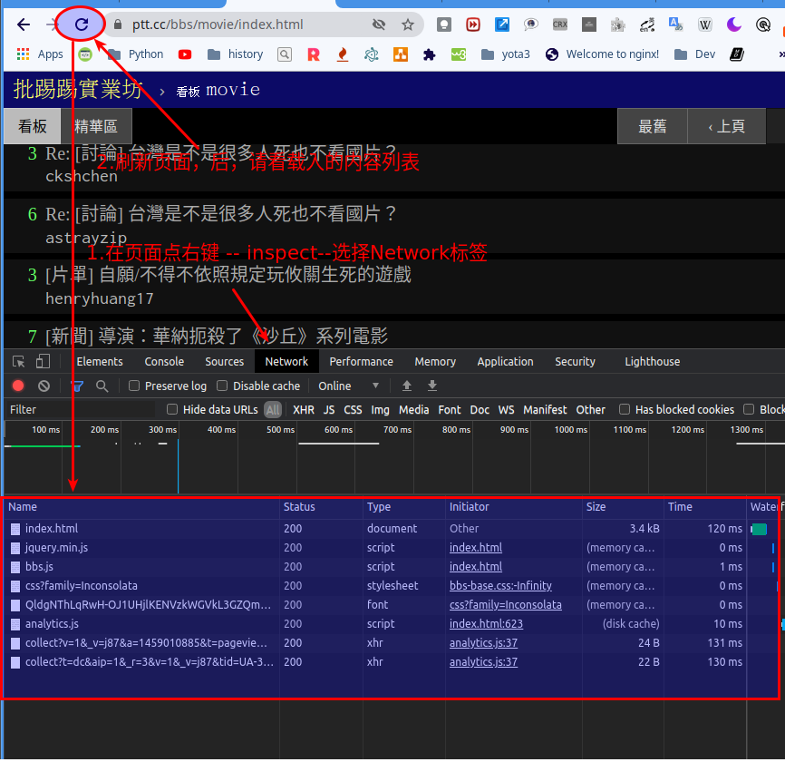
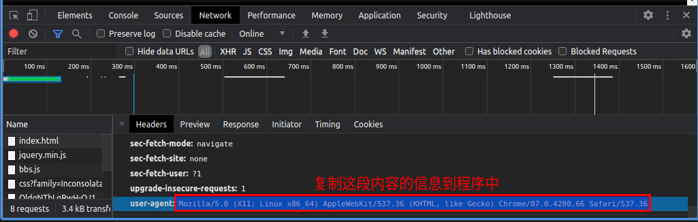
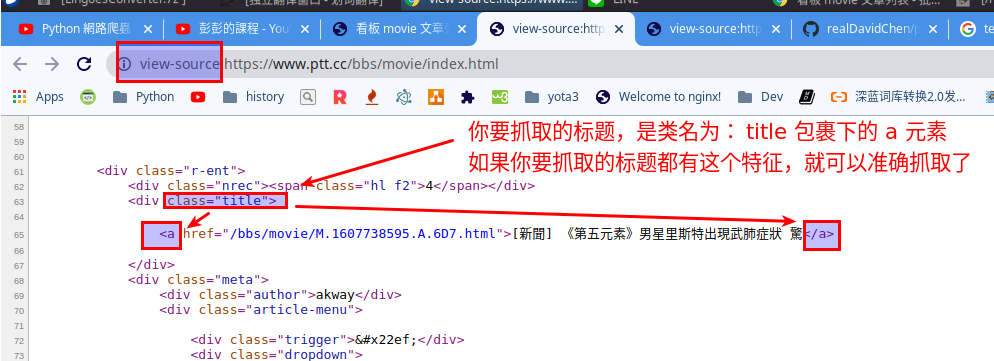

# 网络爬虫基本工作流程

## 安装爬虫软件所需要的插件

$ pip install beautifulsoup4

## 工作流程

- 首先选取一部分精心挑选的种子 URL, 例如抓取这个网页的内容： https://www.ptt.cc/bbs/movie/index.html
- 打开网页，然后在浏览器中点右键 inspect 然后转到 Network 标签，刷新一下页面，相关载入的内容就会呈现在列表中
  

- 取得 user-agent 信息，模拟正常用户服务（网站如果发现所爬虫软件，一般会拒绝访问），获取方法为 点列表中的页面，例如如： index.html --- （右侧 Headers 标签）-- 复制 user-agent 后面的信息： user-agent: Mozilla/5.0 (X11; Linux x86_64) AppleWebKit/537.36 (KHTML, like Gecko) Chrome/87.0.4280.66 Safari/537.36

  

- 建立一个 web-crawler.py 文件，头部载入模块：

```
# 载入beautifulsoup4
import bs4
import urllib.request as req

```

在需要爬虫的网页，点右键- view page sourse, 限定需要抓取的内容，如标题（请注意分析 html 中的网页嵌套关系），如果你要提取的标题，都在同一个相同的 class 包裹下的 a 标签，就可以进行准确抓取：


## 本网络爬虫示例完整代码如下

```

# 载入beautifulsoup4， 抓取原始码
import bs4
import urllib.request as req

# 输入你要抓取的页面
url = "https://www.ptt.cc/bbs/movie/index.html"
# 建立 request物件，附加headers的资讯
request = req.Request(url, headers={
    "User-Agent": "Mozilla/5.0 (X11; Linux x86_64) AppleWebKit/537.36 (KHTML, like Gecko) Chrome/87.0.4280.66 Safari/537.36"
})
with req.urlopen(request) as response:
    data = response.read().decode("utf-8")

# 解析原始代码， 取得每篇文章的标题
root = bs4.BeautifulSoup(data, "html.parser")
titles = root.find_all("div", class_="title")  # 寻找 class="title" div标签
for title in titles:
    if title.a != None:  # 如果标题包含 a 标签（没有被删除），则打印内容
        print(title.a.string)


```

参考教程 https://www.youtube.com/watch?v=9Z9xKWfNo7k&list=PL-g0fdC5RMboYEyt6QS2iLb_1m7QcgfHk&index=19
